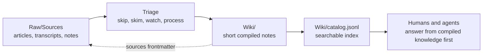

# LLM Wiki Starter

A small starter vault for building an LLM-readable personal or team knowledge base.

The core idea is simple: keep source material separate from compiled knowledge. Raw inputs live in `Raw/`. Reusable, source-backed notes live in `Wiki/`. Agents and humans search the compiled Wiki first, then open Raw sources only when they need the original context.



## What This Is For

Use this repo when you want a lightweight knowledge system that:

- Preserves original source material without turning every source into a long summary.
- Produces short reusable notes that are easy for LLM agents to search and cite.
- Keeps compiled claims traceable back to the Raw sources that support them.
- Gives agents clear maintenance rules through `AGENTS.md`.
- Works as a plain Git repo, with optional Obsidian use on top.

This is intentionally not a full publishing system, Zettelkasten framework, or RAG product. It is a practical scaffold for keeping source-backed knowledge tidy enough that future agents can use it without rereading your entire vault.

## Repository Layout

```text
.
|-- Raw/
|   |-- Sources/        # Source material in Markdown
|   `-- Files/          # Ignored binary/source attachments, except .gitkeep
|-- Wiki/
|   |-- Topics/         # Compiled topic notes
|   |-- Concepts/       # Compiled concept notes
|   |-- Entities/       # People, companies, tools, places
|   |-- Projects/       # Project notes
|   |-- Logs/           # Short process/history notes
|   `-- catalog.jsonl   # Generated searchable index
|-- Schema/             # Frontmatter rules, manifest, examples, schemas
|-- _templates/         # Starter note templates
|-- scripts/            # Build, lint, triage, and audit tools
|-- AGENTS.md           # Rules for LLM agents working in the vault
`-- README.md
```

## The Workflow

1. Add source material to `Raw/Sources/`.
2. Search existing compiled notes before opening a lot of Raw context.
3. Create or update focused notes under `Wiki/`.
4. Link every compiled note back to its Raw source through `sources` frontmatter.
5. Rebuild generated indexes and run lint checks before committing.

The system is built around a two-layer rule:

```text
Raw source material -> compiled Wiki notes -> generated catalog -> agent answers
```

Raw files are allowed to be messy and source-shaped. Wiki notes should be short, reusable, and claim-focused.

## Quick Start

Clone the repo and run the health check:

```bash
python3 scripts/wiki_tool.py doctor
```

Build the generated catalog and indexes:

```bash
python3 scripts/wiki_tool.py build
```

Search compiled knowledge:

```bash
python3 scripts/wiki_tool.py search-catalog --query "llm wiki workflow"
```

Run the maintenance gate before committing:

```bash
python3 scripts/wiki_tool.py build
python3 scripts/wiki_tool.py lint
python3 scripts/wiki_tool.py source-lint
python3 scripts/audit_public.py
```

## Frontmatter Contract

Compiled Wiki notes use source-backed frontmatter. A minimal compiled note looks like this:

```yaml
---
tags:
  - "concept"
topics:
  - "llm wiki"
status: seed
origin: external
sources:
  - "Raw/Sources/example.md"
source_count: 1
---
```

Important rules:

- Use lowercase snake_case for machine-readable frontmatter keys.
- Keep `sources` and `source_count` accurate.
- Use `origin: external`, `personal`, or `mixed`.
- Do not invent citations.
- Prefer several focused notes over one copied source summary.

Raw source notes use fields such as `source_type`, `decision`, and `processed` so the vault can track what has been triaged and what still needs attention. YouTube sources also use `consumption_status` and `consumed_at` so Bases can separate triaged videos from videos Rami has actually watched or skimmed.

## Agent Use

`AGENTS.md` is the operating manual for coding agents and LLM assistants. It tells agents to:

- Search `Wiki/catalog.jsonl` before opening broad Raw context.
- Write reusable knowledge only under `Wiki/`.
- Keep compiled notes linked to Raw sources.
- Run build, lint, source-lint, and public audit checks before commits.

That makes the repo suitable for agentic workflows where you want an assistant to maintain knowledge without quietly turning your vault into unsupported summaries.

## YouTube Triage

This starter includes an example YouTube source workflow. You can list pending videos, triage them, and write structured scoring back into source frontmatter:

```bash
python3 scripts/wiki_tool.py youtube-pending
python3 scripts/wiki_tool.py youtube-triage --pending
```

The triage schema lives at `Schema/youtube-triage-schema.json`. It is designed so different providers can return structured JSON while Python handles validation, scoring, rendering, and linting.

## Public Safety

Before publishing or sharing a vault, run:

```bash
python3 scripts/audit_public.py
```

The audit is intentionally conservative. It checks for obvious secrets, private keys, machine-local paths, plugin/cache state, and other material that should not be committed to a public starter repo.

## How To Adapt It

- Replace the demo Raw sources with your own source notes.
- Adjust `Schema/frontmatter-schema.md` if your note types need different fields.
- Add more templates under `_templates/`.
- Extend `scripts/wiki_tool.py` when you need deterministic checks or generated indexes.
- Keep `AGENTS.md` current whenever you change the rules you expect agents to follow.

The useful part is not the exact folder names. It is the discipline: source material stays preserved, compiled knowledge stays concise, and every reusable claim remains traceable.
